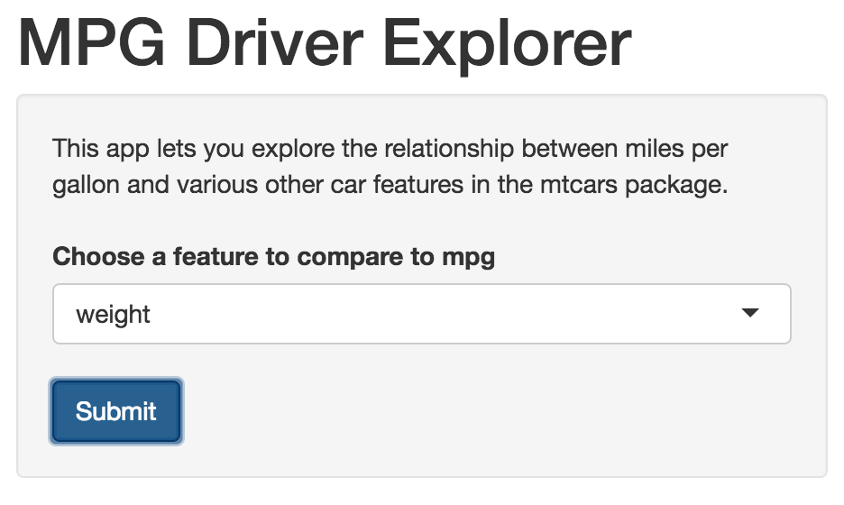
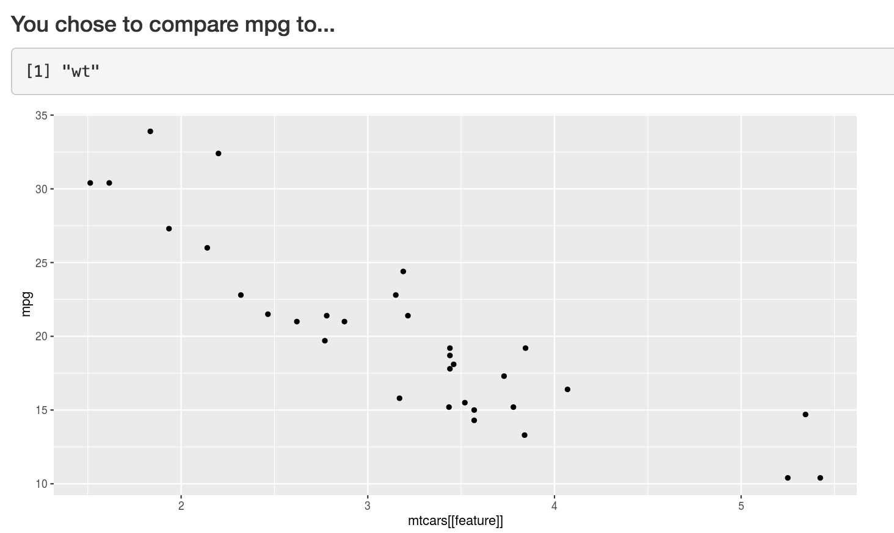

Exploring Mileage Drivers with mtcars
========================================================
author: daddyprasad5
date: August 27, 2016

Exploring Drivers of Mileage with mtcars
========================================================
transition: rotate

The [Exploring Mileage Drivers App](https://daddyprasad5.shinyapps.io/dataproductsproject/) makes data exploration easy!

- No coding skills required
- Quick and easy plotting
- Get quick visual clues about which features are most likely to drive differences in mileage

About mtcars
========================================================

The mt cars dataset includes several features

```r
names(mtcars)
```

```
 [1] "mpg"  "cyl"  "disp" "hp"   "drat" "wt"   "qsec" "vs"   "am"   "gear"
[11] "carb"
```
Which features do you think drives mileage (mpg)?

How it works
========================================================
Just choose a feature from the drop down list box and click submit. 

<div align="center">

</div>

How it works
========================================================
And you'll see a plot that relates the chosen feature to mpg.
<div align="center">

</div>
Have fun exploring!
